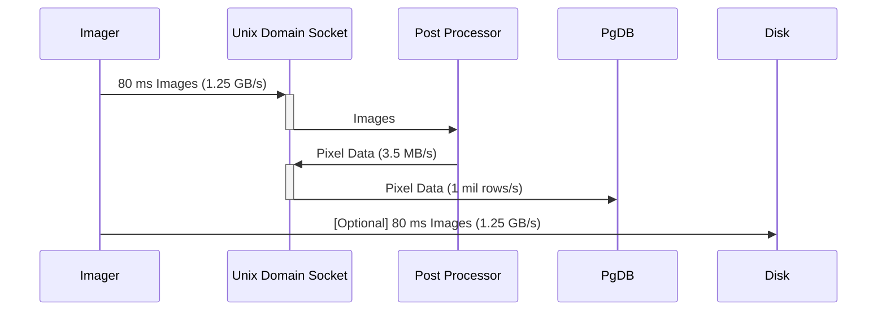
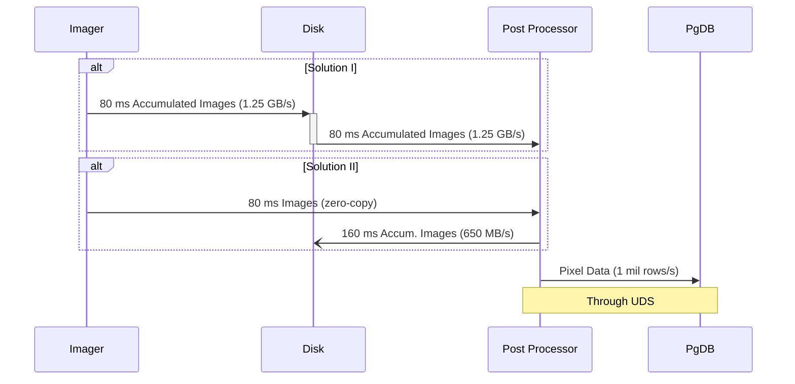

# EPIC MEMO #010

ARIZONA STATE UNIVERSITY TEMPE, ARIZONA 85287

EPIC Imager Data Management

Karthik Apr 4
, 2023

The purpose of this document is to summarize the data rates and storage requirements for raw image and reduced data from the EPIC imaging system. It also describes schemes for data transfer between the imager and post-processing systems.

## Raw Image Data
The second version of EPIC imager is optimized to produce 128x128 pixel images at 32-bit precision. The images will be generated on NVIDIA 4090 RTX GPUs that are capable of simultaneously imaging 128 channels for each of the four cross-polarizations. This imaging yields an image size of 67.11 MB that can be reduced to 50.33 MB by discarding the imaginary components of XX and YY polarizations. The total raw data rate for a nominal integration time of 80 ms with the reduced image size is about 1.25 GB/s for a dual-GPU node or about 5 GB/s for a 4-node dual-GPU setup. This data rate requires a disk size of about 5 TB per node to maintain a 60-minute buffer.

## Post-Processed Data
In addition to temporarily storing individual images in a disk-based buffer, the pixel data will be permanently ingested into a Postgres database for faster retrieval. Pixels in a 3x3 grid centered on each source will be extracted for ingestion from each image. For a nominal list of 10 sources monitored at any given time, the raw pixel data ingestion rate is 3.5 MB/s per node or about 1 million rows/s. In addition, 5-minute image accumulations will be permanently stored to the disk yielding a data rate of 450 KB/s or 14 TB per node per year.

## Data Transfers
The EPIC [post-processing system](https://github.com/epic-astronomy/epic-stream-processor) extracts the pixels for each image and formats the data for ingestion into the database. The initial version used Unix Domain Sockets (UDS) for fetching data from the imager. Figure 1 shows the sequence of operations in this system. The imager transfers each image is to the post-processor through UDS. The processed pixel data is then transferred to the database through UDS. In addition, the imager also optionally saves the images to the disk.

**Figure 1.** Sequence diagram for the Post processing system

Although UDS can support data transfer rates of about ~few GB/s, it only reaches maximum efficiency with a very small number of data transfers with large sizes. The post-processing system achieved about 600 MB/s peak throughput for 90 channel single polarization images (4 MB per image) at 80 ms accumulation time. However, a dual-GPU EPIC imager would produce about 24 images per second for an 80 accumulation time each with a size of about 50 MiB and UDS will be unable to handle this data rate. Additional latency is introduced by transfers to the database that also happen through UDS. Below I describe two possible workarounds for this problem.

### Data Transfer Solution I
The images can be first written to disk that can later be read by the post-processing system (see figure 2). This reduces the load on UDS and improves communication speed with the database, allowing more than a few number of sources to be monitored. Although the current generation NVMe drives can support data rates for about 1 GB/s, it poses practical difficulties in building a suitable machine. For example, the high data rates can be achieved for unidirectional transfers (writes or reads only). However, the post-processor must read the data written by the imager from the disk, and it reduces the data transfer throughput. Furthermore, GPUs like RTX 4090 draw about 450 W, which can limit the power available for these drives in dual GPU systems.

**Figure 2:** Alternative data transfer schemes

### Data Transfer Solution II
An alternative solution is similar to what is described above but using CPU RAM instead of disk storage as a buffer (see figure 2). Here each image will be saved to the main memory and will be read directly by the post-processor without any copy. Such _zero-copy_ transfers can be made using C++ libraries like Cap'n Proto that map memory layout to data model allowing data access without any copying. 

Alternatively, the post-processor can be transformed into a CPU kernel within the imager system. This approach eliminates any need for a transfer medium as the images will be available to the post-processor directly from the GPU.  However, it can introduce a strong coupling between the imager and the post-processor where any latencies in the later can lead to packet losses. This problem can be solved by maintaining a large buffer for the images and invoking multiple post-processor kernels in parallel during any processing lags. 

