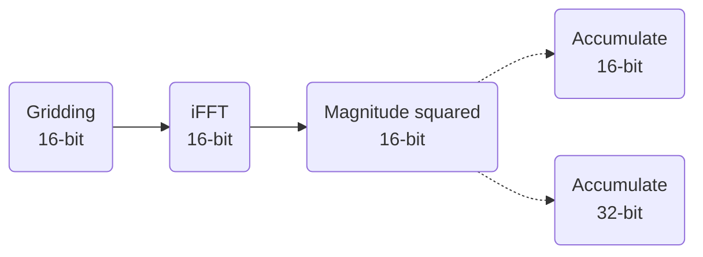

# Float vs. Half Precision Accumulation for EPIC Images

The purpose of this document is to evaluate the uncertainies in pixel values when using half (16-bit) and float (32-bit) precision for image accumulations. The EPIC code uses the IEEE 16-bit floating format available in CUDA that provides 5-bits for the exponent and 10-bits for the significand. 


__Figure 1__: IEEE 16-bit floating number representation

Although CUDA also provides the 16-bit brain float format that has the same range as the IEEE 32-bit float format, it is much less precise than half precision (only 7 bits in the significand). Hence, only half (IEEE 16-bit) and float (IEEE 32-bit) precisions are considered for imaging with EPIC.


### Uncertainties in Float to Half Conversions
Because half precision has 16 fewer bits compared to float, only a limited number of real numbers can be represented at half precision. In CUDA, the half precision numbers can only range from [-65519, 65519], which leads to an error when a float number is converted into half. To estimate this uncertainty, an array of floating-point numbers linearly-spaced by 0.1 covering this range are created and then converted into half precision. Below plots shows a histogram of $1-\frac{hp}{fp}$ for all the numbers. The entire range of falls within [-0.005,.0.005] or and error of 0.5%.


**Figure 1:** Histogram for the ratio of half and float numbers ($1-\frac{hp}{fp}$)

Figure 2 shows the ratio of half and float representations of each number plotted against their actual values. Interestingly, the negative values appear to be represented with a smaller magnitude than their positive counterparts at half-precision.

**Figure 2:** Ratio of half and float numbers plotted against their actual value 

### Accumulation process in EPIC gpu code
The voltages are gridded on to the aperture plane and inverse Fourier transformed at half precision. The accumulation of pixels from each sequence can be done with half or float precisions. Below I describe the proceedure used to estimate the level of uncertainty introduced by using half precision over float.

An image size of 128x128 is assumed and two numbers (real and imaginary) are drawn for each pixel from a normal distribution and stored in the memory at half precision. These complex values represent the half precision complex output from FFT. Sets of 1000 such images are drawn each with a different variance. The images in each set are accumulated into a final image in by squaring the magnitude of each pixel. Although the mangnitude is computed at half precision, the accumulation is done both at half and float precisions. The figure below demonstrates the accumulation process.


The table below shows the results for images drawn with $\sigma^2=[1,3,5]$. The following expressions are used to document the uncertainties:

* $err = \frac{X_{16-bit}-X_{32-bit}}{X_{32-bit}}$
* $RMSE = \sqrt{\sum_{i=0}^{N}\frac{(X^i_{16-bit}-X^i_{32-bit})^2}{N}}$, where $N=16834$


|    |$\sigma^2=1$|$\sigma^2=3$|$\sigma^2=5$|
|----|------------|------------|------------|
|RMSE             |13.6109|142.7036|416.2372
|$\mu$ (16-bit)   |1988.2915|17872.7129|49616.3535
|$\mu$ (32-bit)   |2000.0710|17998.2622|49985.9625
|$\sigma (32-bit)$|64.1390|571.5700|1581.6285
|$\sigma (16-bit)$|63.9943|578.5777|1572.5657
|$\mu_{err}$ %    |0.5892|0.6963|0.7400
|$max_{err}$ %    |1.8856|2.2548|2.2147

 These results indicate that although the mean pixel values appear similar for both 16-bit and 32-bit accumulations, the mean uncertainty increases with increasing variance in the image. No clear trend appears in the max error percentage. The variance value is limited to 5 to prevent overflow in half precision numbers.

 Figure 3 shows the kernel density estimate (KDE) plots of pixel values for each chosen $\sigma^2$. Half precision values are mostly underrepresented in magnitude compared to their float counterparts. This feature remains constant across a wide range of values with the means varing from 2000 to 50000.

 

 **Figure 3:** Kernel Density Estimate (KDE) plots for pixels values at half and float precisions, drawn from normal distributions.

 Figure 4 shows KDE plots of the ratio of pixels values at half and float precisions. As indicated in table 1, nearly all the values are within 1% of each other. Interestngly, the KDE for pixel values drawn using $\sigma^2=1$ appears different from those drawn using $\sigma^2=3,5$. It is due to the smaller uncertainty between half and float precisions in represnting values close to 0 (see figure 2).


 

 **Figure 4:** KDE plot for the ratio of pixel values at half and float precisions $(\frac{hp}{fp})$, drawn from normal distributions. 

The above experiment is repeated by replacing the normal distribution with a uniform distribution in the range $[-i, i]$ where $i=[1,2,4,8]$. The results are shown in the table below. Interestingly, unlike the values drawn from a normal distribution, uniformly distributed values show similar mean percentage errors across all ranges but no clear trend is observed in the maximum percetage error.

|    |$i=1$|$i=2$|$i=4$|$i=8$|
|----|-----|-----|-----|-----|
|RMSE             | 3.4471|13.7685|54.7876|219.0682
|$\mu$ (16-bit)   | 664.3783|2657.4327|10631.3120|42518.0254
|$\mu$ (32-bit)   | 666.5838|2666.3130|10666.2334|42658.2675
|$\sigma (32-bit)$| 13.6780|54.9692|218.4792|872.2980
|$\sigma (16-bit)$| 13.3469|53.6718|213.2631|852.1508
|$\mu_{err}$ %    | 0.3339|0.3361|0.3304|0.3317
|$max_{err}$ %    | 1.7629|1.8441|2.0045|1.7118

 Figure 5 shows the kernel density estimate (KDE) plots of pixel values for each chosen range. Similar to values drawn from a normal distribution, half precision values are mostly underrepresented in magnitude compared to their float counterparts. This feature remains constant across a wide range of values with the means varing from 2000 to 50000. Moreover, the mean error remains similar across all the chosen ranges. 

 

 **Figure 5:** KDE plots for pixels values at half and float precisions, drawn from uniform distributions.

Figure 6 shows KDE plots of the ratio of pixels values at half and float precisions, drawn from uniform distributions. As indicated in table 2, nearly all the values are within 1% of each other. The mean error is about 0.4% $\pm$ 0.4%. 


**Figure 6:** KDE plot for the ratio of pixel values at half and float precisions $(\frac{hp}{fp})$, drawn from uniform distributions.

In conclusion, while the error in a pixel can reach up to $\sim2.3\%$, the absolute mean error is less than $1\%$ for values drawn using normal and uniform distributions. Hence, a conservative value on the error can be taken as 1.5%. The code used in this analysis is provided below.

<details>
<summary>Source Code</summary>

```c++
#include <algorithm>
#include <cmath>
#include <cstdlib>
#include <ctime>
#include <cuda_bf16.h>
#include <cuda_fp16.h>
#include <fstream>
#include <iomanip>
#include <iostream>
#include <random>

void
run_sim(float rand_max, bool d_norm = true, bool bright_source=false)
{
    static std::random_device rd;
    static std::mt19937 gen(rd());

    auto normal = std::normal_distribution<>(0, rand_max);
    auto uniform = std::uniform_real_distribution<>(-rand_max, rand_max);

    auto bright_normal = std::normal_distribution<>(rand_max/2, rand_max/2);

    std::string fname = d_norm ? "Normal_" : "Uniform_";
    if(bright_source){
        fname += "bright_";
    }
    fname += std::to_string(int(rand_max)); 

    int img_size = 128;
    int npixels = img_size * img_size;
    int ntimes = 1000;
    int nelem = img_size * img_size * ntimes;
    using hp_t = __half;
    using bf_t = __nv_bfloat16;

    using accum_t = hp_t;
    hp_t* hf_vec_re = (hp_t*)malloc(sizeof(hp_t) * nelem);
    hp_t* hf_vec_im = (hp_t*)malloc(sizeof(hp_t) * nelem);
    float* xx_fp = (float*)malloc(sizeof(float) * npixels);
    accum_t* xx_hp = (accum_t*)malloc(sizeof(accum_t) * npixels);
    srand(time(NULL));
    for (int i = 0; i < nelem; ++i) {
        hf_vec_re[i] = d_norm ? hp_t(normal(gen)) : hp_t(uniform(gen));
        hf_vec_im[i] = d_norm ? hp_t(normal(gen)) : hp_t(uniform(gen));

        if(bright_source && i%npixels==0){
            hf_vec_re[i] = bright_normal(gen);
            hf_vec_im[i] = bright_normal(gen);
        }
    }

    for (int i = 0; i < npixels; ++i) {
        xx_fp[i] = 0;
        xx_hp[i] = 0.f;
    }

    // accumulate
    for (int i = 0; i < ntimes; ++i) {
        for (int j = 0; j < npixels; j++) {
            int vec_idx = i * npixels + j;
            hp_t xx = hf_vec_re[vec_idx] * hf_vec_re[vec_idx] + hf_vec_im[vec_idx] * hf_vec_im[vec_idx];

            xx_hp[j] = xx_hp[j] + xx;
            xx_fp[j] += xx;
        }
    }

    // compute the root mean square error and mean
    // max percent error
    float err = 0;
    float mean_hp = 0;
    float mean_fp = 0;
    float max = 0;
    float mean_err = 0;

    std::ofstream fp;
    fp.open(fname + "_fp.txt");
    std::ofstream hp;
    hp.open(fname + "_hp.txt");
    for (int i = 0; i < npixels; ++i) {
        float _temp = xx_hp[i] - xx_fp[i];
        err += _temp * _temp;
        mean_hp += xx_hp[i];
        mean_fp += xx_fp[i];

        mean_err += std::abs((xx_hp[i] - xx_fp[i]) / xx_hp[i]);
        max = std::max(max, std::abs((xx_hp[i] - xx_fp[i]) / xx_hp[i]));
        fp << xx_fp[i] << " ";
        hp << float(xx_hp[i]) << " ";
    }
    fp.close();
    hp.close();
    err = (err) / float(npixels);

    std::cout << "RMSE: " << std::sqrt(err) << std::endl;
    std::cout << "MEAN HP: " << mean_hp / npixels << std::endl;
    std::cout << "MEAN FP: " << mean_fp / npixels << std::endl;
    std::cout << "MAX PERCENT ERROR: " << max * 100 << std::endl;
    std::cout << "MEAN PERCENT ERROR: " << mean_err * 100 / npixels << std::endl;

    if(bright_source){
        std::cout<<"Bright_source hp: "<<xx_hp[0]<<std::endl;
        std::cout<<"Bright_source fp: "<<xx_fp[0]<<std::endl;
    }
}

int
main()
{
    float variances[3] = { 1, 3, 5 };
    float uni_max[4] = { 1, 2, 4, 8 };

    for (int i = 0; i < 3; ++i) {
        std::cout << std::endl
                  << "Normal dist, sigma=" << variances[i] << std::endl;
        run_sim(variances[i]);
    }

    for (int i = 0; i < 3; ++i) {
        std::cout << std::endl
                  << "Normal dist, sigma=" << variances[i] << std::endl;
        run_sim(variances[i],true,true);
    }

    for (int i = 0; i < 4; ++i) {
        std::cout << std::endl
                  << "Uniform dist, max=" << uni_max[i] << std::endl;
        run_sim(uni_max[i], false);
    }

    for (int i = 0; i < 4; ++i) {
        std::cout << std::endl
                  << "Uniform dist, max=" << uni_max[i] << std::endl;
        run_sim(uni_max[i], false,true);
    }
    return 0;
}
```

</details>