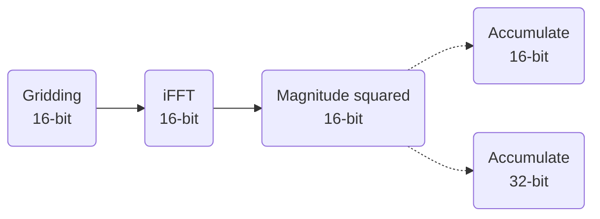

# Float vs. Half Precision Accumulation for EPIC Images

The purpose of this document is to evaluate the uncertainies in pixel values when using half (16-bit) and float (32-bit) precision for image accumulations. The EPIC code uses the IEEE 16-bit floating format available in CUDA that provides 5-bits for the exponent and 10-bits for the significand. 


__Figure 1__: IEEE 16-bit floating number representation

Although CUDA also provides the 16-bit brain float format that has the same range as the IEEE 32-bit float format, it is much less precise than half precision (only 7 bits in the significand). Hence, only half and float precisions are considered for imaging with EPIC.

### Accumulation process in EPIC gpu code
The voltages are gridded on to the aperture plane and inverse Fourier transformed at half precision. The accumulation of pixels from each sequence can be done with half or float precisions. Below I describe the proceedure used to estimate the level of uncertainty introduced by using half precision over float.

An image size of 128x128 is assumed and two numbers (real and imaginary) are drawn for each pixel from a normal distribution and stored in the memory at half precision. These complex values represent the half precision complex output from FFT. Sets of 1000 such images are drawn each with a different variance. The images in each set are accumulated into a final image in by squaring the magnitude of each pixel. Although the mangnitude is computed at half precision, the accumulation is done both at half and float precisions. The figure below demonstrates the accumulation process.


The table below shows the results for images drawn with $\sigma^2=[1,3,5]$.

|    |$\sigma^2=1$|$\sigma^2=3$|$\sigma^2=5$|
|----|------------|------------|------------|
|RMSE|13.7235|144.31|416.523|
|$\mu$ (16-bit)|0.116882|1.05078|2.89062|
|$\mu$ (32-bit)|0.11683|1.05150|2.92077|
|$\mu_{err}$ %|0.611436|0.72341|0.754951|
|$max_{err}$ %|1.90557|2.33184|2.26731|

The error percentage in each pixel is calculated as $abs(\frac{X_{16-bit}-X_{32-bit}}{X_{16-bit}})$. These results indicate that although the mean pixel values appear similar for both 16-bit and 32-bit accumulations, the mean uncertainty increases with increasing variance in the image. No clear trend appears in the max error percentage. The variance value is limited to 5 to prevent overflow in half precision numbers.

The above experiment is repeated by replacing the normal distribution with a uniform distribution in the range $[-i, i]$ where $i=[1,2,4,8]$. The results are shown in the table below. Interestingly, unlike the values drawn from a normal distribution, uniformly distributed values show similar mean percentage errors across all ranges but no clear trend is observed in the maximum percetage error.

|    |$i=1$|$i=2$|$i=4$|$i=8$|
|----|-----|-----|-----|-----|
|RMSE|3.45291|13.8057|54.9299|219.72|
|$\mu$ (16-bit)|0.0400391|0.162476|0.645996|2.58398|
|$\mu$ (32-bit)|0.0403022|0.162706| 0.645558|2.58223|
|$\mu_{err}$ %|0.424965|0.423683|0.421666|0.422823|
|$max_{err}$ %|1.93859|2.15906|1.84839|1.90194|

In conclusion, while the error in a pixel can reach up to $\sim2.3\%$, the mean error is less than $1\%$ for values drawn using normal and uniform distributions. The code used in this analysis is provided below.

<details>
<summary>Source Code</summary>

```c++
#include <algorithm>
#include <cmath>
#include <cstdlib>
#include <ctime>
#include <cuda_bf16.h>
#include <cuda_fp16.h>
#include <iostream>
#include <random>

float
get_random(float max = 0.01)
{
     static std::random_device rd;  
    static std::mt19937 gen(rd());
    static std::normal_distribution<> dis(2, max); 
    return dis(gen);
}

float
get_random2(float max = 0.01)
{
    static std::random_device rd;  
    static std::mt19937 gen(rd());
    static std::uniform_real_distribution<> dis(-max, max); 
    return dis(gen);
}

int
main()
{
    int img_size = 128;
    int npixels = img_size * img_size;
    int ntimes = 1000;
    int nelem = img_size * img_size * ntimes;
    int rand_max = 7;
    using hp_t = __half;
    using bf_t = __nv_bfloat16;

    using accum_t = hp_t;
    hp_t* hf_vec_re = (hp_t*)malloc(sizeof(hp_t) * nelem);
    hp_t* hf_vec_im = (hp_t*)malloc(sizeof(hp_t) * nelem);
    float* xx_fp = (float*)malloc(sizeof(float) * npixels);
    accum_t* xx_hp = (accum_t*)malloc(sizeof(accum_t) * npixels);
    srand(time(NULL));
    for (int i = 0; i < nelem; ++i) {
        hf_vec_re[i] = hp_t(get_random2(rand_max));
        hf_vec_im[i] = hp_t(get_random2(rand_max));
    }

    for (int i = 0; i < npixels; ++i) {
        xx_fp[i] = 0;
        xx_hp[i] = 0.f;
    }

    // accumulate
    for (int i = 0; i < ntimes; ++i) {
        for (int j = 0; j < npixels; j++) {
            int vec_idx = i * npixels + j;
            hp_t xx = hf_vec_re[vec_idx] * hf_vec_re[vec_idx] + hf_vec_im[vec_idx] * hf_vec_im[vec_idx];
            xx_hp[j] = xx_hp[j] + xx;
            xx_fp[j] += xx;
        }
    }

    // compute the root mean square error and mean
    // max percent error
    float err = 0;
    float mean_hp = 0;
    float mean_fp = 0;
    float max = 0;
    float mean_err = 0;
    for (int i = 0; i < npixels; ++i) {
        float _temp = xx_hp[i] - xx_fp[i];
        err += _temp * _temp;
        mean_hp = xx_hp[i];
        mean_fp = xx_fp[i];

        mean_err += std::abs((xx_hp[i] - xx_fp[i]) / xx_hp[i]);
        max = std::max(max, std::abs((xx_hp[i] - xx_fp[i]) / xx_hp[i]));
    }
    err = (err) / npixels;

    std::cout << "RMSE: " << std::sqrt(err) << std::endl;
    std::cout << "MEAN HP: " << mean_hp / npixels << std::endl;
    std::cout << "MEAN FP: " << mean_fp / npixels << std::endl;
    std::cout << "MAX PERCENT ERROR: " << max * 100 << std::endl;
    std::cout << "MEAN PERCENT ERROR: " << mean_err * 100 / npixels <<pre std::endl;

    return 0;
}
```

</details>
